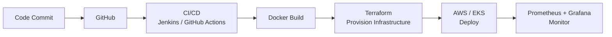

<h1 align="center">Hi, I'm Sameed Khan 👋</h1>

<h3 align="center">Aspiring Cloud & DevOps Engineer</h3>

  

  
  
  

---

## 👨‍💻 About Me

I'm a **Cloud & DevOps enthusiast** focused on building real, hands-on infrastructure rather than just reading about it. I work with **Infrastructure as Code, containers, CI/CD, automation, and monitoring**, and I learn best by building projects and documenting them in public.

- ☁️ Building and automating cloud infrastructure on **AWS**, with exposure to **Azure** and **GCP**
- 🏗️ Writing reusable, modular infrastructure with **Terraform**
- 🐳 Containerizing applications with **Docker** and learning orchestration with **Kubernetes / AWS EKS**
- ⚙️ Learning to design **CI/CD pipelines** with Jenkins and GitHub Actions
- 📊 Exploring observability with **Prometheus** and **Grafana**
- 💼 Connect with me on [LinkedIn](https://www.linkedin.com/in/sameed-khan-a6824538a?utm_source=share_via&utm_content=profile&utm_medium=member_android)

---

## 🧰 Tech Stack

  

| Category | Technologies |
|:--|:--|
| **Cloud Platforms** | AWS, Azure, GCP |
| **Infrastructure as Code** | Terraform |
| **Containers & Orchestration** | Docker, Docker Compose, Kubernetes, AWS EKS |
| **CI/CD** | Jenkins, GitHub Actions |
| **Configuration Management** | Ansible |
| **Monitoring & Observability** | Prometheus, Grafana |
| **Version Control** | Git, GitHub |
| **Operating System** | Linux |
| **Scripting** | Python, Bash |

---

## 🔄 DevOps Workflow I'm Building Towards

---

## 🚀 Featured Projects

| Project | Description | Tech |
|:--|:--|:--|
| 🐧 **[Linux Commands](https://github.com/Sameedkhan469/Linux-commands)** | Complete Linux command reference from beginner to advanced, covering file management, permissions, processes, networking, storage, AWS EBS/EFS, monitoring, systemd, shell scripting, logging, and DevOps commands. | `Linux` `Bash` `AWS` `DevOps` |
| 🏗️ **[Terraform Three-Tier Architecture](https://github.com/Sameedkhan469?tab=repositories)** | Three-tier AWS infrastructure provisioned using Terraform, including VPC, subnets, load balancer, EC2, security groups, and RDS. | `AWS` `Terraform` `VPC` `ALB` `EC2` `RDS` |
| 📦 **[Terraform Modules](https://github.com/Sameedkhan469?tab=repositories)** | Reusable infrastructure using root, child, and Terraform Registry modules with variables and outputs. | `Terraform` `Modules` `IaC` |
| ⚙️ **[Terraform Provisioners](https://github.com/Sameedkhan469?tab=repositories)** | EC2 automation using `local-exec` and `remote-exec` provisioners. | `Terraform` `EC2` `Automation` |
| 🐳 **[Docker Projects](https://github.com/Sameedkhan469?tab=repositories)** | Hands-on containerization and multi-container applications using Docker and Docker Compose. | `Docker` `Docker Compose` |
 | 🛒 **[E-Commerce Platform on AWS](https://github.com/Sameedkhan469/sameed-ecommerce-aws-terraform)** | Multi-tier AWS e-commerce app deployed with Terraform — Nginx frontend, Flask backend, and RDS MySQL across public/private subnets. | `AWS` `Terraform` `EC2` `RDS` `Nginx` `Flask` |

<b>🏗️ Three-Tier Architecture: what's inside</b>

 

- Custom **VPC** with public and private subnets
- **Application Load Balancer** distributing traffic to the application tier
- **EC2** instances for the application layer
- **RDS** database isolated in private subnets
- **Security Groups** enforcing least-privilege access between tiers
- Fully modular **Terraform** code for reuse across environments

<!--
  TIP: Once you know your exact repo names, you can replace the table links above
  with direct repo URLs, or enable pinned-style cards below by replacing REPO_NAME.

  

-->

---

## 📚 Currently Learning

  
  
  
  
  

---

## 🎯 Goals

- [x] Build AWS infrastructure using Terraform modules
- [x] Practice Docker and Docker Compose
- [ ] Build end-to-end CI/CD pipelines with Jenkins and GitHub Actions
- [ ] Deploy and manage workloads on Kubernetes and AWS EKS
- [ ] Set up monitoring dashboards with Prometheus and Grafana
- [ ] Build real-world, production-style DevOps projects
- [ ] Strengthen multi-cloud knowledge across AWS, Azure, and GCP

---

## 📈 GitHub Statistics

---

## 🐍 Snake Game Repo View

  

---

## 🤝 Let's Connect

I'm open to learning opportunities, collaborations, and conversations about Cloud and DevOps.

  
  

---

  <b>☁️ Build • ⚙️ Automate • 🚀 Deploy • 📊 Monitor</b>

  ⭐ Thanks for visiting my profile!

